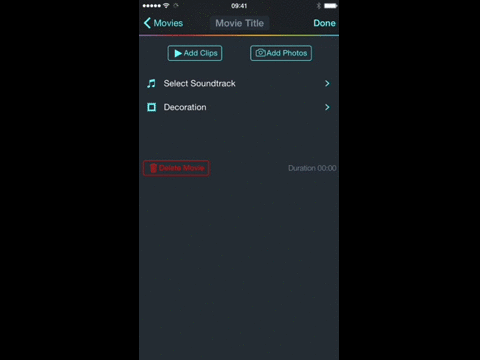

# DVGAssetPickerController

This is an attempt to reimplement Apple's UI from Messages.app for iOS where
you can select photos from Camera Roll to attach to your imessage.

We successfully use this component in our own [Together video editing app](https://2gzr.com) for iOS where users could import photos using this component into video compilations. Here is how DVGAssetPickerController looks in action:

## Usage

To run the example project, clone the repo, and run `pod install` from the Example directory first.

## Requirements

iOS 8.1

## Installation

DVGAssetPickerController is available through [CocoaPods](http://cocoapods.org). To install
it, simply add the following line to your Podfile:

    pod "DVGAssetPickerController"

## Author

DENIVIP Group, support@denivip.ru

## License

DVGAssetPickerController is available under the MIT license. See the LICENSE file for more info.

